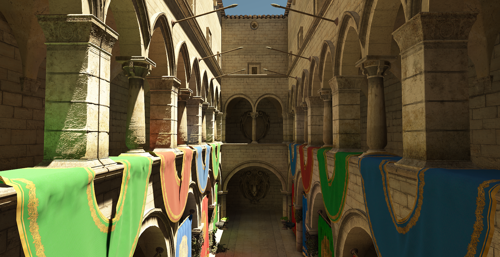

# Atlas Engine
[![The MIT License][license-image]][license-url]
[![Code quality][code-quality-image]][code-quality-url]

[license-image]: https://img.shields.io/badge/License-MIT-yellow.svg
[license-url]: https://opensource.org/licenses/MIT
[code-quality-image]: https://api.codiga.io/project/10000/score/svg
[code-quality-url]: https://app.codiga.io/public/project/10000/Atlas-Engine/dashboard

  
*Realtime GI demo scene*  
#### The current version is a WIP which means many changes and less stability.
## Introduction
This is a cross platform toy engine that is available on Linux and Windows.
## Requirements
- OpenGL 4.3
- C++17 compatible compiler
## Set up
Before you start compiling make sure to download the dependencies into **./dependencies**. You can either do
this manually or use one of the available scripts. The build process is then done using CMake.
### Compiling the demo application
Run CMake with the option ATLAS_DEMO=ON to include the demo application in the project. For easier use, the vsbuild.bat does exactly
that and launches Visual Studio afterwards. After launching the IDE, set AtlasEngineDemo as your target.
>**Note:**
>In order to start the application properly you might need to change the asset directory in the [demo source file](https://github.com/tippesi/Atlas-Engine/blob/master/demo/App.cpp).
### Including the library into your own project
It is possible to compile the engine either as a shared or static library. Set the ATLAS_BUILD_SHARED option accordingly. To make
the library work with its dependencies, the root CMakeLists.txt of this repository has to be added as a subdirectory. As an entry
point to create an application from scratch take a look at the [Hello World tutorial](https://github.com/tippesi/Atlas-Engine/wiki/Hello-World). For reference, the source folder contains an empty [app header](https://github.com/tippesi/Atlas-Engine/blob/master/src/App.h) and an empty [app source](https://github.com/tippesi/Atlas-Engine/blob/master/src/App.cpp).
<!---
### Android
You can compile the engine using Gradle either with or without AndroidStudio.
The Gradle project can be found in **./platform/android**. Open it before you proceed.
There are also two options available: Start a new project with a predefined
main file which you can edit. The second option is two use the engine as a subproject in an already existing project. 

**Note: Right now there is a bug in the NDK that prevents a successful build. Last version which worked was NDK 18.x. NDK 22.x shouldn't have any problems. To prevent any issues, don't let Android Studio automatically upgrade the NDK or Gradle versions of the project.**
#### New project using the engine
You can find the main file at **./src/main.cpp**. Just start your project there, it already
contains a main function. 
#### Excisting project using the engine
There exist two options:
- You can use the engine as a Gradle subproject.
- You can use the engine as a CMake subproject. Just copy the **./platform** folder to the folder
of the CMake root project. In the **./platform/android/app/src/main/java/com/atlasengine/app** file add the root library name and load
the project with Android Studio. The CMake project has to be compiled as a shared library. Make sure that the path to your data in the
asset directory is correct.
-->
### CMake build options
- **ATLAS_BUILD_SHARED** Force project to be build as a shared library
- **ATLAS_OPENGL_ES** Use OpenGL ES instead of OpenGL on desktop devices
- **ATLAS_EXPORT_MAIN** Export the main file to be added as executable to parent project (only if main function cannot be found)
- **ATLAS_NO_APP** Disables the engines main function and app functionality. You have to code the main function and
initialize the engine yourself
- **ATLAS_IMGUI** Enables the [ImGui](https://github.com/ocornut/imgui) integration. Is enabled by default if the demo project is build.
- **ATLAS_ASSIMP** Enables the [Assimp](https://github.com/assimp/assimp) integration. Is enabled by default.
## Documentation
If you want more information have a look into the [Documentation](https://tippesi.github.io/Atlas-Engine-Doc/index.html).
## License
The source code is licensed under the MIT license. The copyright notices of the dependencies can be found
in the LICENSE.md file in the dependency directory. 
>**Note:**
>The files in the data folder (except the shaders) use a different license. 
## Code Example
For a code example have a look at the [demo application](https://github.com/tippesi/Atlas-Engine/tree/master/demo).
## Screenshots
  
*Rasterized image using real time global illumination*  

*Path traced scene*
  
*Island demo scene using the terrain and ocean systems*  
  
*PBR rendering*  
