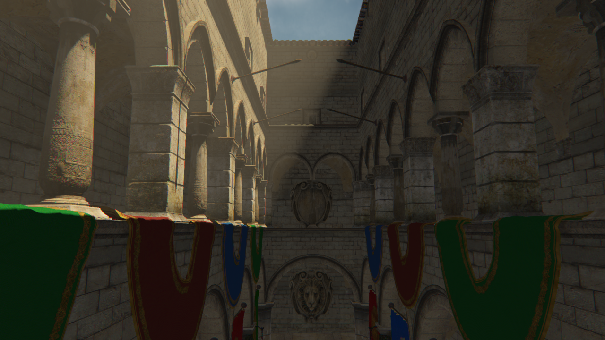

# Blue Engine

## Introduction
This is a cross platform engine that is available on all major platforms including Linux, Windows and MacOS.
>**Note:**
>MacOS only supports OpenGL up to version 4.1. Some features aren't available there.
## Requirements
- OpenGL 4.3 or higher
- OpenGL ES 3.2
## Installation
The installation is done using CMake. There are two options available: Start a new project with a predefined
main file which you can edit. The second option is two use the engine as a subproject in an already existing project.
>**Note:**
>The engine is only able to compile and run in an 64 bit environment.
#### New project using the engine
After running CMake you can find the main file at **./src/main.cpp**. Just start your project there, it already
contains a main function.
#### Excisting project using the engine
There exist two options:
- You can use the engine as a CMake subproject. Just go ahead and use **add_subdirectory** in the root
CMakeLists.txt of your project. Afterwards add **target_link_libraries(YOUR_TARGET ... BlueEngine ${BLUE_ENGINE_LIBS})**. You should be fine.
- You can compile the engine and all dependencies as a static library (note that some dependencies also have
dynamic libraries). Therefore use the BUILD_LIBRARY option when using CMake. After compiling the library
with your favourite build system you shouldn't forget to also copy all the libraries and include them to your project.
You can find them in **./lib/YourFavouriteSystem/**.
## Documentation
If you want more information have a look into the [Documentation](https://tippex97.github.io/Blue-Engine/index.html)
## General performance tips
- Use static/stationary objects and lights as often as possible
- Use textures with the same size and format for each material
- Set mesh data or any kind of data prior to rendering. More importantly: Don't create data while rendering.
- If you are programming additional renderers or content always use the mapping feature of the vertex buffers.
  Don't use SetData() often, use SetSubData instead.
  Also try to avoid using OpenGL, use existing engine features instead
## Code Example
This code example can also be found in the main file.
```c
#include <Engine.h>
#include <input/Mouse.h>
#include <input/Keyboard.h>

int main(int argc, char* argv[]) {

	Window* window = Engine::Init("../data/shader", "Blue Engine", WINDOWPOSITION_UNDEFINED,
		WINDOWPOSITION_UNDEFINED, 1280, 720, WINDOW_RESIZABLE | WINDOW_BORDERLESS);

	Camera* camera = new Camera(47.0f, 2.0f, 1.0f, 200.0f);
	camera->location = glm::vec3(30.0f, 25.0f, 0.0f);
	camera->rotation = glm::vec2(-3.14f / 2.0f, 0.0f);

	Terrain* terrain = new Terrain(9, 7, 16, 0.5f, 30.0f);

	Texture* texture = new Texture("../data/image.png");

	window->SetIcon(texture);

	RenderTarget* target = new RenderTarget(1920, 1080);

	Scene* scene = new Scene();

	Cubemap* cubemap = new Cubemap("../data/cubemap/right.png",
		"../data/cubemap/left.png",
		"../data/cubemap/top.png",
		"../data/cubemap/bottom.png",
		"../data/cubemap/front.png",
		"../data/cubemap/back.png");

	scene->sky->skybox = new Skybox(cubemap);

	scene->postProcessing->chromaticAberration = new ChromaticAberration(0.7f);

	Mesh* mesh = new Mesh("../data/cube.dae");
	Mesh* sponzaMesh = new Mesh("../data/sponza/sponza.dae");

	Actor* actor = new Actor(mesh);
	Actor* sponza = new Actor(sponzaMesh);
	sponza->modelMatrix = scale(mat4(1.0f), vec3(0.05f));

	MasterRenderer* renderer = new MasterRenderer();

	SceneNode* node = new SceneNode();

	Light* globalLight = new Light(DIRECTIONAL_LIGHT);
	globalLight->direction = vec3(0.0f, -1.0f, 0.5f);
	globalLight->diffuseColor = vec3(253, 194, 109) / 255.0f * 3.0f;
	globalLight->ambient = 0.05f;
	globalLight->AddShadow(new Shadow(125.0f, 0.004f, 2048, 3, 0.7f), camera);
	globalLight->AddVolumetric(new Volumetric(target->width / 2, target->height / 2, 20, -0.5f));

	node->Add(actor);
	scene->rootNode->Add(node);

	scene->Add(sponza);

	scene->Add(globalLight);

	node->transformationMatrix = translate(vec3(0.0f, 1.0f, 5.0f));

	// We create the controller handler
	MouseHandler* mouseHandler = CreateMouseHandler(camera, 1.5f, 0.25f);
	mouseHandler->lock = true;
	KeyboardHandler* keyboardHandler = CreateKeyboardHandler(camera, 7.0f, 0.3f);

	// For now we will leave the main loop here until we implement a more advanced event system
	// Our event structure
	SDL_Event event;
	bool quit = false;

	// We need the time passed per frame in the rendering loop
	unsigned int time = 0;

	// Handle events and rendering here
	while (!quit) {

		unsigned int deltatime = SDL_GetTicks() - time;
		time = SDL_GetTicks();

		// Poll all the events
		while (SDL_PollEvent(&event)) {

			if (event.type == SDL_QUIT) {

				// If the SDL event is telling us to quit we should do it
				quit = true;

			}
			else if (event.type == SDL_KEYDOWN && event.key.keysym.sym == SDLK_ESCAPE) {

				// If the user presses escape we also want to quit
				quit = true;

			}
			else if (event.type == SDL_KEYDOWN && event.key.keysym.sym == SDLK_ESCAPE) {

				// If the user presses escape we also want to quit
				quit = true;

			}
			else if (event.type == SDL_MOUSEBUTTONDOWN && event.button.button == SDL_BUTTON_LEFT) {

				mouseHandler->lock = false;

			}
			else if (event.type == SDL_MOUSEBUTTONUP && event.button.button == SDL_BUTTON_LEFT) {

				mouseHandler->lock = true;

			}

		}

		CalculateMouseHandler(mouseHandler, camera, deltatime);
		CalculateKeyboardHandler(keyboardHandler, camera, deltatime);

		camera->UpdateView();
		camera->UpdateProjection();

		scene->rootNode->transformationMatrix = glm::rotate((float)time / 1000.0f, vec3(0.0f, 1.0f, 0.0f));
		actor->modelMatrix = glm::rotate((float)time / 500.0f, vec3(0.0f, 1.0f, 0.0f));

		scene->Update();

		globalLight->shadow->Update(camera);

		renderer->RenderScene(window, target, camera, scene);

		window->Update();

	}

	return 0;

}
```
As you may have seen it's pretty easy to use the engine. One thing I have to warn you is that the rendering parts of the 
code are **not thread-safe**. So it's recommended to keep the rendering in just one thread. Loading textures, shaders and 
vertex buffers can be safely done in another thread.
## License
License is not available at the moment. Just don't do dumb stuff with the code. This is really appreciated.
